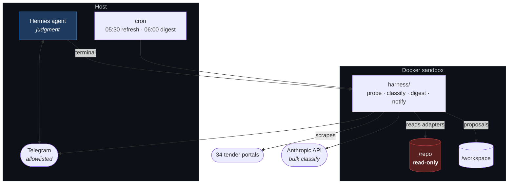
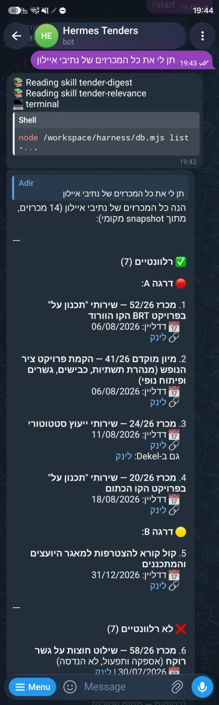

# tenders-hermes

**An AI agent deployed over a live production pipeline — and the audit that
found the pipeline had been silently broken for weeks.**

A working system scrapes 34 Israeli infrastructure tender portals nightly and
surfaces the relevant ones to engineers at a project-management firm. This
repository puts an agent alongside it: doing the parts that need judgment,
leaving the deterministic parts alone, and structurally unable to modify
production.

The first thing it produced was not a feature. It was a bill of health nobody
had asked for.

---

## The finding

The nightly workflow reported success every morning. It had been green for
weeks. Underneath, **only 11 of 34 portals were returning anything** — and the
cause had nothing to do with the code.

Same code, same day, three origins:

| Origin | Portals reachable | Refused | Open tenders collected |
|---|---|---|---|
| GitHub Actions (production) | 11 / 34 | — | 260 |
| Hetzner (Germany) | 12 / 34 | 16 | — |
| Home connection (Israel) | 29 / 34 | 2 | 271 |
| **GCP `me-west1` (Tel Aviv)** | **31 / 34** | **1** | **438** |

**The scrapers were never broken. They were blocked from where they ran.**
Israeli agency portals refuse foreign IPs — it is geo-blocking, not hosting
reputation, which the German datacenter result establishes: a *datacenter* IP
inside Israel works while a datacenter IP outside it does not.

Deploying to Tel Aviv recovered **21 portals with zero code changes**, and
`rail` (רכבת ישראל) along with them — a portal earlier triage had written off
as blocked from every origin, which now yields tenders including a tier-A
railway consulting RFP the client could not previously see.

Nobody noticed, because of one unchecked return value:

```ts
// fetchStatic.ts — correct
if (!res.ok) throw new Error(`HTTP ${res.status} from ${url}`);

// fetchDynamic.ts — the bug
await page.goto(url, { waitUntil: 'domcontentloaded' });  // resolves on 403
return await page.content();                              // returns the block page
```

`page.goto()` does not throw on a 403 — it resolves. So a Cloudflare block
returned 27 KB of error page, zero rows extracted, and the run logged:

```
[nta] ✓ 0 tenders
```

A tick mark, for a hard block. That single omission is the entire reason 13
portals failed loudly and 7 failed silently — same block, two reporting
behaviours. **Success with an empty result set is the failure mode nobody builds
an alert for.**

Every finding is written to `staged/` as a proposal. Nothing here patches
production.

---

## Architecture



The agent reaches production **only** through a read-only mount. It cannot write
to the repo, cannot write to the database, and cannot reach the desktop.

---

## The principle

> **The agent goes where judgment is required. Deterministic code stays where
> determinism is correct.**

34 hand-tuned selector configs over Hebrew government portals are fast, free and
reproducible. Replacing them with an LLM would be slower, costlier and
non-deterministic. What actually needs judgment is *is this tender relevant*,
*why did this collector stop working*, and *is this new portal worth adding*.

That split runs through everything. The agent curates `criteria/relevance.md`;
a cheap deterministic script applies it to hundreds of tenders a night. The
06:00 digest runs with **no LLM in the loop at all** — putting one in an
unattended path that needs no judgment buys nothing and adds a way to fail.

---

## What it looks like



A question in Hebrew — *"give me all the נתיבי איילון tenders"* — and the reply.
Five things in that screenshot are the whole design:

- **It loads skills, then runs a tool.** `tender-digest` and `tender-relevance`,
  then `db.mjs list` inside the sandbox. It is not answering from the model's
  memory of the conversation.
- **It names its data source** — *מתוך snapshot מקומי*, "from a local snapshot".
  The production table is unreadable to this credential (RLS with no anon
  policy), so the tooling falls back and says so. An agent that quietly implied
  it had read production would be worse than one that failed.
- **It separates relevant from not**, 7 and 7, and tiers the relevant ones A/B —
  rather than dumping 14 rows and leaving the engineer to sort them.
- **It shows the disqualified ones with reasons** — *שילוט חוצות (אספקה ותפעול,
  לא הנדסה)*: outdoor signage, supply and operation, not engineering. Saying
  *why* something was rejected is what makes the filter auditable.
- **"גם ב-Dekel"** — it flags a tender that also appears on a second portal.
  That cross-portal duplication was found by the agent, not by me: `dekel` is a
  shared bidding platform re-listing other bodies' tenders, so 11 rows were
  duplicates and 3 would have appeared twice in one digest. Production's
  `(site, tender_id)` key cannot see it.

## What it does

**Relevance.** On 271 open tenders, the agent's criteria flag **45** as relevant
where the live keyword rules flag **16** — and *reject* 5 the keyword rules
accept. Every rejection is a keyword hit on ניהול/בקרה in a disqualified domain:
security-system supply, maintenance control, acoustics, energy management,
architectural design. A keyword filter structurally cannot make that call, and
the criteria are prose the client's own engineer can edit.

**Digest.** Hebrew RTL, grouped by publisher, soonest deadline first, 🔴/🟠
urgency markers, delivered to Telegram at 06:00. Silent when there is nothing
new — a bot that says "nothing today" every day is one people learn to swipe
away, and then they swipe away the day it mattered.

**Diagnosis.** A skill that diagnoses a dead scraper, classifies the failure,
and writes a proposal a human reviews.

---

## The agent got it wrong, and the fix went into the skill

Pointed at a dead portal, the agent did everything right — read the config,
probed the live page, cross-checked static against dynamic rendering without
being asked — and concluded:

> production is missing a working headless browser

**Wrong.** Another portal using the identical fetcher returned 180 tenders in
the same run, which disproves it outright.

The gap was in the skill, not the model. Its decision table had no entry for the
failure class that actually dominates here, and nothing forced it to check
whether other sites sharing that infrastructure were fine. Both were added:

```diff
+ | Works from your origin, zero/403 in production | **Origin block (IP reputation)** |
+
+ 4. **Before blaming shared infrastructure, run the differential.**
+    A single passing site with the same `fetcher` disproves the hypothesis
+    outright. This check is mandatory.
```

Re-run on the same site, the agent now reports **Origin block (IP reputation)**
and cites the passing site as its disproof.

Nothing was retrained, re-prompted or argued with. The *procedure* was
corrected, and the correction is durable, inspectable, and applies to every
future site.

---

## Guardrails

Structural, not instructional. The agent is not *told* to leave production
alone; it is unable to.

| Control | Mechanism | Verified |
|---|---|---|
| Cannot modify production | `/repo` mounted `:ro` | `touch /repo/x` → `Read-only file system` |
| Cannot write to the database | Only the anon key is forwarded; `service_role` never enters the container | — |
| Cannot reach the desktop | `computer_use` disabled; Telegram limited to an explicit toolset | — |
| Cannot be used by strangers | `TELEGRAM_ALLOWED_USERS` allowlist; Hermes fails closed | — |
| Cannot silently gain skills | `write_approval` + `guard_agent_created` | — |
| Cannot quote a stale finding | `session_reset: idle`; skills forbid answering data questions from memory | — |

That last one came from production use: the agent reported an empty database
three times in one conversation, twice *after* a working fallback had been
added, because it was quoting itself instead of re-running the query.

---

## Evaluation

**Recall governs.** A false positive costs an engineer ten seconds of reading; a
false negative is a tender the firm never got to bid on.

| Run | Recall | Precision |
|---|---|---|
| Full criteria | 100% | 100% |
| **Examples stripped (holdout)** | **100%** | **100%** |

The first number is worthless, and is shown only to explain the second. The
criteria file embeds paraphrases of the client's 29 labelled examples, and the
eval set *is* those 29 — the classifier was being graded on its own answer key.
`eval/make-holdout.mjs` strips them so the score reflects the stated rules alone.

Even the holdout is not out-of-sample: the rules were derived from these
examples. A real generalisation number needs tenders nobody has seen. **That
measurement is pending, and this README will say so until it isn't.**

A side-effect worth knowing: the holdout run cost *more* than the full one
($0.093 vs $0.051) despite a shorter prompt. Stripping the examples dropped the
criteria below Haiku 4.5's 4096-token minimum cacheable prefix, silently
disabling caching. The classifier warns about this explicitly, because the only
way to detect it is to read `cache_read_input_tokens` back and check it is
non-zero.

---

## Layout

```
criteria/relevance.md      the classifier's rules — Hebrew prose, client-editable
harness/
  lib/source.mjs           resolves Supabase vs snapshot, always reports which
  lib/supabase.mjs         read-only access (anon key, GET only)
  lib/probe-core.mjs       shared fetch / analyse / classify for diagnosis
  db.mjs                   list · new · sites · health · sample · get
  probe-all.mjs            sweep every portal from any origin (~21s)
  compare-origins.mjs      join a production run against a probe run
  scrape-local.ts          run the real production adapters, no database
  classify.mjs             bulk classification, cached criteria prompt
  digest.mjs               Hebrew RTL digest
  notify.mjs               Telegram delivery, line-safe chunking
  refresh.sh               scrape → classify → snapshot
eval/
  build-set.mjs            labelled set from the client's own examples
  make-holdout.mjs         strips examples so the eval measures something
  score.mjs                precision / recall / F1 — recall governs
skills/tenders/            four skills, read-only to the agent
staged/                    agent proposals awaiting human review
```

---

## Deployed

Running unattended on a GCP `me-west1` (Tel Aviv) instance:

- **05:30** — scrape 34 portals, classify, write snapshot
- **06:00** — render the Hebrew digest, deliver to Telegram
- Telegram gateway live as a systemd service, restricted to one user ID
- Agent reachable conversationally: it loads its skills, queries in the
  sandbox, and reports which data source it used

Both scheduled jobs were **proved by forcing a run**, not left to fire
unattended and hope. That caught a real failure: Hermes does not export `.env`
into `--no-agent` cron jobs, so the refresh job scraped all 34 portals and then
died at the classifier with `ANTHROPIC_API_KEY not set`. The digest job had
succeeded in the same environment because it needs no secrets — the two jobs
differ in exactly the dimension that mattered, so the passing one proved
nothing about the failing one.

It failed *safely* — `refresh.sh` writes to a temp file and only moves it into
place on success, so the previous good snapshot survived and the warning was
delivered. But failing safely is not working.

## Running it

See **[DEPLOY.md](DEPLOY.md)**. Step 0 is verifying the host's IP can reach the
portals at all — 60 seconds, and it decides whether the deployment is worth
paying for. On a rented box that check cost about one cent and ruled out a
provider before any commitment.

```bash
docker build -t tenders-agent:1.0 docker/
docker run --rm -v $PWD:/workspace -w /workspace tenders-agent:1.0 npm install
docker run --rm -v <production-repo>:/repo:ro -v $PWD:/workspace -w /workspace \
  -e REPO_PATH=/repo tenders-agent:1.0 bash harness/refresh.sh
```

**Cost:** ~€7/month for the host, ~$8–10/month for classification, agent
inference on a Claude subscription.

---

## Notes

- The client is anonymised. Tender titles are public procurement records; the
  labelled record of which contracts a specific firm bids on is not, and does
  not belong in a public repository.
- Secrets live in the Hermes `.env` and are forwarded by name. Nothing
  credential-bearing is in this repository.
- `state/` is gitignored. A probe run from one machine says nothing about what
  another host would see, and a committed one invites being read as a fact.
- Built with [Hermes Agent](https://github.com/NousResearch/hermes-agent) (MIT).
